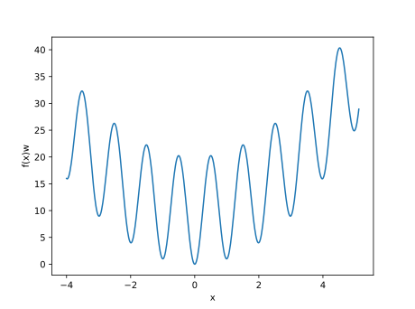

---
# Optimizing Continuous Functions of One Variable - Performing a Global Search
---

Portfolio Optimization with Two Stocks
-------------------------

Some functions are difficult to optimize using algorithms that perform local search or use gradients, since they can get stuck in locally optimal solutions. In such situations, it may be worth to consider an algorithm based on global search. The optim4j package provides several globally convergent algorithms for optimizing functions of a single variable.

To illustrate this problem, consider the well-known Rastrigin function in one dimension:

.

A sketch of the function on the domain above



reveals that it has many local optimum points. We will use a global search algorithm to optimize this function.

Solving the Optimization Problem with optim4j
-------------------------

1. Import the necessary packages

```java
import java.util.function.Function;

import opt.univariate.UnivariateOptimizerSolution;
import opt.univariate.order0.PiyavskiiAlgorithm;
```

2. Define the cost function to optimize

```java
// 1D Rastrigin function
Function<Double, Double> rastrigin = x -> {
	return 10.0 + x * x - 10.0 * Math.cos(2.0 * Math.PI * x);
};
```

3. To optimize this function, we will use a global search method for Lipschitz functions called the Piyavskii method. This algorithm is quite powerful because it will automatically learn the Lipschitz constant while performing function evaluations.

```java
PiyavskiiAlgorithm optimizer = new PiyavskiiAlgorithm(1e-4, 999);
UnivariateOptimizerSolution solution = optimizer.optimize(rastrigin, -4.0, 5.12);
```

4. Report and interpret the final result

```java
System.out.println(solution);
System.out.println("Final f(x*) = " + rastrigin.apply(solution.getOptimalPoint()));
```

The output of this program should be

x*: -4.108939877159715E-6<br>
calls to f: 88<br>
calls to df/dx: 0<br>
converged: true<br>
Final f(x*) = 3.349532207153061E-9

The algorithm is able to find the global optimal solution in 88 function evaluations. 
