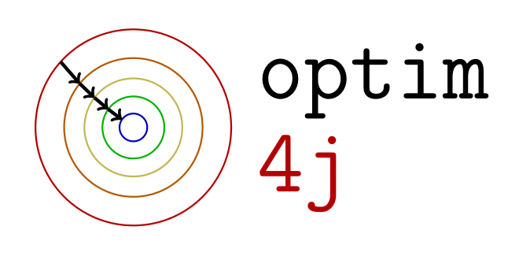

---
# Optim4J
---

*optim4j* is a free and open-source library of subroutines for performing local and global minimization of non-linear functions (some state-of-the-art), written entirely in Java. It consists of:

1. existing subroutines, often written originally in other programming languages (mostly Fortran and C/C++) and provided generously for the benefit of the public, that were translated to Java
2. algorithms implemented from scratch based on existing literature.

**This library is a work in progress (read: beta version). There can still be errors in translation (e.g. from other packages) or errors in code written for this package. Detailed testing of current algorithms still remains to be done, and many additional features and algorithms will be added in the future.**

Download and Installation
-------------------------

There are currently only two ways to install the project: 

1. Download the java archive from the [releases page](https://github.com/mike-gimelfarb/optim4j/releases) and use it directly in your projects.

2. Download the source code and compile it locally on your machine:

-	[v0.1.zip](https://codeload.github.com/mike-gimelfarb/optim4j/zip/v0.1)
-	[v0.1.tar.gz](https://codeload.github.com/mike-gimelfarb/optim4j/tar.gz/v0.1)

Maven support will be provided in the near future.

Documentation
----------------

The classification of available algorithms and their related work can be found [here](algorithms.md).

Licensing
----------------

The project, as a whole, is licensed under the Lesser General Public License, version 2 or later. However, algorithms written entirely by us can be used separately under the MIT license. License information for each file is available in the source codes.

Acknowledgements
----------------

We are grateful to all the [authors](acknowledgements.md) who have provided optimization libraries under open-source licenses. 
